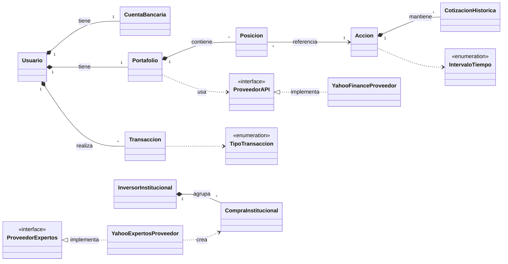
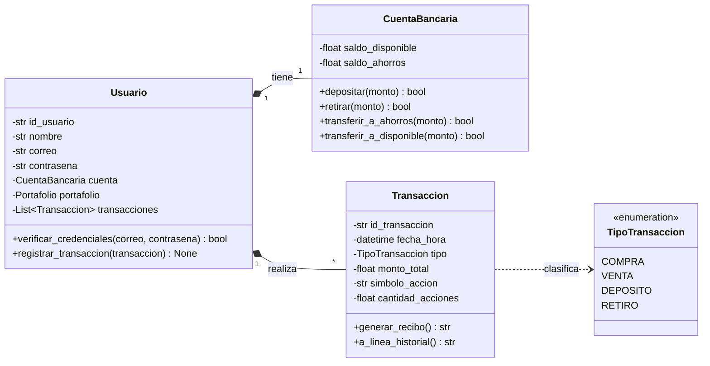
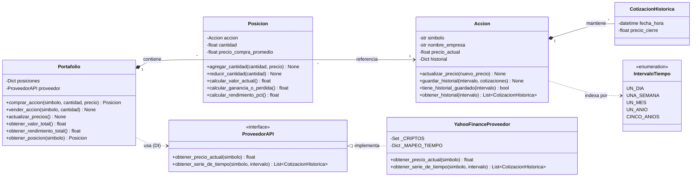
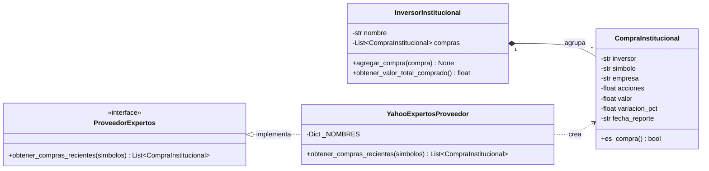
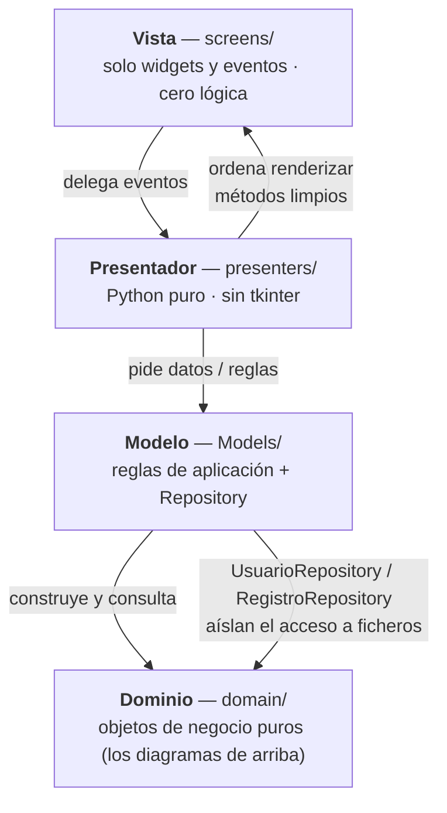

# 📐 Diagramas de Clase — Tracker Financiero (MVP + Modelo de Dominio OO)

> Documento de referencia de la arquitectura de `feature/Model`.
> Los diagramas están en **Mermaid**, el mismo formato que genera el bot
> **Sourcery** en su *Reviewer's Guide*, por lo que GitHub los renderiza
> automáticamente y sirven de **fuente de verdad** para contrastar lo que
> produzca el bot.
>
> Estructura elegida (basada en Fowler, *UML Distilled*): **un diagrama general**
> de toda la arquitectura **+ varios diagramas detallados por subsistema**, en
> lugar de un único diagrama gigante e ilegible. La **herencia** (interfaz →
> implementación) se muestra explícitamente dentro de cada subsistema.

## Índice

1. [Cómo leer estos diagramas (notación)](#0-cómo-leer-estos-diagramas-notación)
2. [Diagrama general (Overview)](#1-️-diagrama-general-overview)
3. [Subsistema: Usuario, Cuenta y Movimientos](#2--subsistema-usuario-cuenta-y-movimientos)
4. [Subsistema: Portafolio y Precios de Mercado (con herencia)](#3--subsistema-portafolio-y-precios-de-mercado-con-herencia)
5. [Subsistema: Expertos / compras institucionales (con herencia)](#4--subsistema-expertos--compras-institucionales-con-herencia)
6. [Arquitectura MVP (capas y dependencias)](#5--arquitectura-mvp-capas-y-dependencias)
7. [Cómo visualizar, descargar y modificar](#6-️-cómo-visualizar-descargar-y-modificar-los-diagramas)
8. [Instrucciones para el bot (Sourcery)](#7--instrucciones-para-el-bot-sourcery)
9. [Referencias](#8--referencias)

---

## 0. Cómo leer estos diagramas (notación)

**Visibilidad de los miembros:**

| Símbolo | Significado |
|:------:|-------------|
| `+` | público |
| `-` | privado (en Python, atributo `__nombre`) |
| `#` | protegido |
| `~` | de paquete |

**Tipos de relación (flechas):**

| Notación Mermaid | Relación UML | Significado |
|:----------------:|--------------|-------------|
| `<\|--` | Herencia / generalización | "es un" |
| `<\|..` | Realización | implementa una interfaz |
| `*--` | Composición | el todo **posee** la parte; si muere el todo, muere la parte |
| `o--` | Agregación | relación débil; la parte vive por su cuenta |
| `-->` | Asociación | "conoce a" / "referencia a" |
| `..>` | Dependencia | "usa" (acoplamiento temporal) |

Las cifras `"1"` y `"*"` sobre las líneas indican la **multiplicidad** (uno, muchos).

> En Python las propiedades de solo lectura (`@property`) se muestran como métodos
> públicos sin parámetros; los atributos privados (`__x`) aparecen con visibilidad `-`.

---

## 1. 🗺️ Diagrama general (Overview)

Vista de pájaro de **todo el dominio** y sus relaciones. Se omiten los métodos a
propósito (los detalla cada subsistema) para que la estructura global se lea de
un vistazo.



**Lectura.** `Usuario` es la **raíz del agregado**: posee por composición su
`CuentaBancaria`, su `Portafolio` y su lista de `Transaccion`. El `Portafolio`
agrupa `Posicion`es, y cada `Posicion` referencia una `Accion` cuyo historial son
`CotizacionHistorica`s. Las dos **interfaces** (`ProveedorAPI`, `ProveedorExpertos`)
desacoplan el dominio de la fuente externa de datos; sus implementaciones Yahoo se
muestran con la flecha de realización `<|..`.

---

## 2. 👤 Subsistema: Usuario, Cuenta y Movimientos

Núcleo de identidad y dinero del usuario. Aquí vive toda la lógica de mover saldos.



**Lectura.** `CuentaBancaria` encapsula dos "bolsas" (disponible / ahorros) y
**garantiza que nunca queden saldos negativos** (cada método valida antes de mover
dinero y devuelve `bool`). `Transaccion` es un **objeto inmutable** (atributos
privados expuestos solo por propiedades) que sabe serializarse al historial
(`a_linea_historial`) y generar un recibo legible (`generar_recibo`). Su naturaleza
se modela con el `enum TipoTransaccion`, evitando *strings* mágicos.

---

## 3. 📈 Subsistema: Portafolio y Precios de Mercado (con herencia)

Inversiones del usuario y el **patrón Strategy / Adapter + Inyección de Dependencias**
para obtener precios sin acoplar el dominio a `yfinance`.



**Lectura.** `Portafolio` **no conoce** Yahoo Finance: depende de la abstracción
`ProveedorAPI` que se le **inyecta por constructor** (`..> ProveedorAPI`). En
producción se inyecta `YahooFinanceProveedor` (Adapter que traduce los `DataFrame`
de `yfinance` a `float` y `CotizacionHistorica`), y en pruebas se puede inyectar un
proveedor simulado. La herencia `ProveedorAPI <|.. YahooFinanceProveedor` es la
**única "subclase" real** del dominio de precios. `Posicion` calcula valor y
rendimiento; `Accion` cachea historiales por `IntervaloTiempo`.

---

## 4. 🏦 Subsistema: Expertos / compras institucionales (con herencia)

Muestra qué activos han **comprado** los grandes inversores (Berkshire, Vanguard,
BlackRock…). Repite el **mismo patrón** Strategy + Adapter del subsistema de precios.



**Lectura.** `CompraInstitucional` es otro **Value Object** inmutable con la regla
de negocio `es_compra()` (solo cuenta si el inversor **aumentó** posición,
`variacion_pct > 0`). `YahooExpertosProveedor` adapta
`yfinance.Ticker.institutional_holders` y, si no hay datos en vivo, devuelve un
conjunto curado de respaldo para que la pantalla nunca quede vacía. La herencia
`ProveedorExpertos <|.. YahooExpertosProveedor` es la segunda jerarquía del proyecto.

---

## 5. 🧱 Arquitectura MVP (capas y dependencias)

Cómo se **usa** el dominio anterior desde la interfaz, respetando MVP estricto.



**Reglas de oro (MVP estricto):**

- Un archivo de `presenters/` **nunca** importa `tkinter`/`messagebox`.
- Una clase de `screens/` **nunca** hace cálculos de negocio ni accede a disco.
- El acceso a ficheros vive solo en los `*Repository` o en los `*Model`.
- El paquete `domain/` **no** depende de Tkinter ni de pandas/yfinance.

---

## 6. 👁️ Cómo visualizar, descargar y modificar los diagramas

**Visualizar:**

- **GitHub** renderiza automáticamente los bloques ` ```mermaid ` de este `.md`.
- En el **PR**, Sourcery publica su *Reviewer's Guide* con los diagramas como
  imagen y un botón para **copiar** el código Mermaid.
- En **VS Code**: extensión *Markdown Preview Mermaid Support* (vista previa en vivo).

**Descargar (imagen PNG/SVG/PDF):**

1. Copia el bloque Mermaid de la sección que quieras.
2. Pégalo en **https://mermaid.live** → menú *Actions* → *Export* (PNG / SVG).
3. Alternativa: el diagrama `diagram.puml` (PlantUML) se exporta desde
   https://www.plantuml.com/plantuml o el plugin de PlantUML en el IDE.

**Modificar:**

- Edita directamente los bloques ` ```mermaid ` de este archivo y vuelve a abrir
  la vista previa: la sintaxis está documentada en la sección 0 y en las referencias.
- También puedes editar el código que Sourcery entregue en el PR y pegarlo aquí.

---

## 7. 🤖 Instrucciones para el bot (Sourcery)

Para que la review del PR sea **detallada, clara y metódica**:

1. Sourcery publica por defecto el **PR Summary** + la **Reviewer's Guide** con
   **diagramas Mermaid**. Si no aparecen, comenta en el PR:
   - `@sourcery-ai guide` → regenera la guía del revisor (incluye diagramas).
   - `@sourcery-ai review` → fuerza una nueva revisión completa.
   - `@sourcery-ai summary` → regenera el resumen de cambios.
2. **Qué se espera que diagrame**: las clases del paquete `domain/` con sus
   **métodos** y relaciones (composición, dependencia y las dos jerarquías de
   interfaz `ProveedorAPI`/`ProveedorExpertos`), tal como aparecen en este archivo.
3. **Criterio de aceptación**: cada clase del dominio debe aparecer con sus métodos
   públicos; las dos relaciones de herencia (`<|..`) deben estar presentes; debe
   distinguirse el dominio de las capas MVP.

---

## 8. 📚 Referencias

1. **Fowler, M.** — *UML Distilled: A Brief Guide to the Standard Object Modeling
   Language* (3.ª ed.), Addison-Wesley. Notación, visibilidad, composición/agregación,
   interfaces y la recomendación de **varios diagramas enfocados** en vez de uno gigante.
   <https://www.oreilly.com/library/view/uml-distilled-a/0321193687/>
2. **Mermaid** — *Class diagrams* (documentación oficial). Sintaxis exacta que emite
   Sourcery. <https://mermaid.js.org/syntax/classDiagram.html>
3. **GitHub Docs** — *Creating diagrams* (Mermaid en Markdown y PRs).
   <https://docs.github.com/en/get-started/writing-on-github/working-with-advanced-formatting/creating-diagrams>
4. **Sourcery** — *Reviewer's Guide & Mermaid diagrams* (changelog 2024-11-06).
   <https://sourcery.ai/changelog/2024-11-06>
5. **"UML Class Diagram Relationships Explained: Every Arrow Type"** — guía de los
   tipos de flecha. <https://wildandfreetools.com/blog/uml-class-diagram-relationships-explained/>
6. **"Creating Class Diagrams with Mermaid.js"** — newdevsguide.
   <https://newdevsguide.com/2023/04/08/mermaid-class-diagrams/>
7. **Kutaj, P.** — *"Explaining Class Diagrams in Mermaid"*, Medium.
   <https://pavolkutaj.medium.com/explaining-class-diagrams-in-mermaid-efc16e72b6e3>

---

*Generado como referencia para la revisión automática de Sourcery sobre `feature/Model`.*
